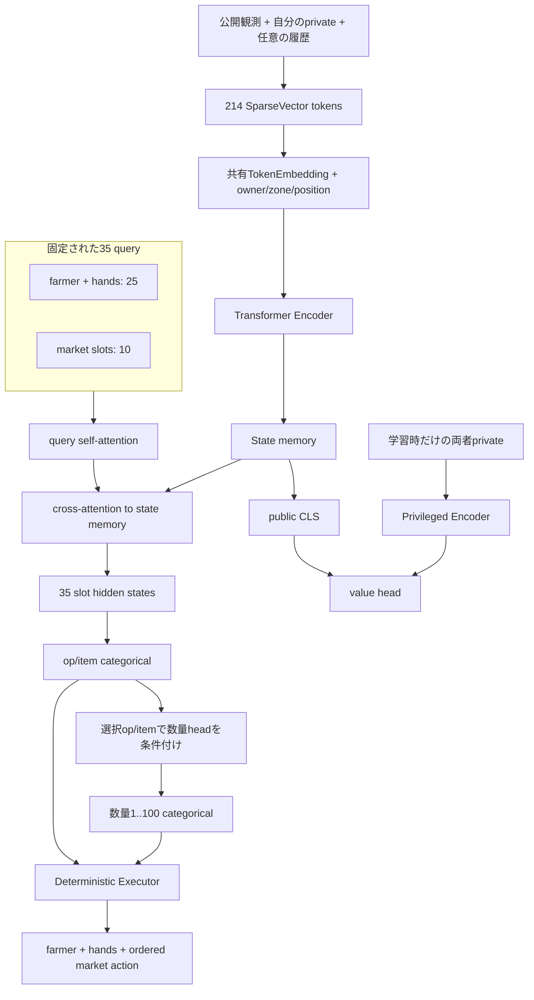

# kaggriculture.policy

盤面全体を1回符号化し、farmer・全hands・市場10slotを共同出力する固定slot方策です。
旧自己回帰方策は推論コストが高すぎたため廃止し、Git履歴だけに残しています。

## 構成

| 場所 | 役割 |
|---|---|
| `common/` | 語彙、token配置、モデル設定 |
| `jax/` | GPU学習用モデル、合法mask、Executor、履歴 |
| `torch/` | CPU提出モデル、観測token化、GBDT用候補処理 |

JAX PPOでは観測変換、合法mask、方策、Executor、シミュレータ、GAE、更新をGPU上で処理します。
Torch版はJAX checkpointからActorだけを変換し、JAXがないKaggle評価環境で使用します。

## 入力とモデル

Actorには本番で観測可能な情報だけを渡します。両者の10×10盤面、公開player情報、自分の
shed・seeds・unit inventory、市場、街、時刻、任意の累積履歴を214個のSparseVectorへ変換します。
各tokenは`LayerNorm(sum(value_i * embedding[index_i]))`で埋め込みます。品目IDは観測と
行動候補で共有するため、盤面上のWHEATとWHEATを植える・売る候補は同じ実体表現を使います。



Encoderは1ターンに1回だけ実行します。query層は35 query同士をself-attentionで混合し、固定された
状態memoryへcross-attentionします。各slotは同じTransformer出力から決まるため、農夫、hands、
市場を盤面全体との整合性を含めて共同予測できます。

## 合法手とExecutor

unitはターン開始時点で合法な候補だけをmaskします。市場は先行slotのSELLやHIREで後続の合法性が
変化するため、ネットワークは構造上可能な候補を共同出力し、Executorがslot順に再検証します。

Executorは次を決定論的に処理します。

- 非active handをPASSへ変換
- PICKUP・PLACE・売買数量を実行可能上限へクランプ
- 全unitのPLANT要求が種数を超えた作物を一括PASS化
- 市場注文をslot順にshadow stateへ反映
- 無効な市場slotをno-opへ変換
- WAITを数量0のSELL、STOPを注文列終了として表現

Executorは戦略を追加するものではありません。方策のintentを環境契約に収める境界です。無効化率と
クランプ率はPPOログで監視し、方策がExecutorへ過度に依存していないか確認します。

採点前には合法maskと別にstrategy maskを重ねます。共有規則は
`common/strategy.py`、状態表現に依存する判定はJAX/Torch各`strategy.py`に置きます。
現在の追加規則は、市場の最終slotで結果がSTOPと等しいWAITを除くものだけです。
unitのPASSを一律に除外する規則はありません。同じmaskがBC学習、PPOの選択・再評価、
Torch提出推論に適用されます。候補IDやモデル重みの形状は変わりません。

## 数量

数量は連続回帰ではなく1〜100のcategoricalです。量ごとに別の語彙indexを持ち、log正規化した
連続成分も補助的に加えます。LayerNorm後も数量を区別でき、BCの交差エントロピーとPPOの
log probabilityへ通常の行動選択と同様に含められます。

## 非対称critic

`use_asymmetric_critic=true`では、価値headだけが両プレイヤーの非公開shed・seeds・inventoryと、
現金・概算資産・土地・hand数の明示的なマクロ特徴を参照します。Actorは公開memoryしか使いません。
したがって非対称criticは学習時だけ有効で、提出時はcritic全体を安全に除外できます。

## API

### JAX

| API | 用途 |
|---|---|
| `policy.sample_actions` | 1プレイヤーの全slotを共同生成 |
| `policy.sample_self_play_actions` | 両プレイヤーを1 batchで生成 |
| `policy.evaluate_intent` | BC/PPOで保存済みintentを再評価 |
| `policy.state_values` | bootstrap value |
| `executor.execute` | intentを固定shape simulator actionへ変換 |

### Torch

| API | 用途 |
|---|---|
| `policy.predict_action` | JAXなしのCPU提出推論 |
| `candidate_api.decode_with_candidates` | GBDT用の逐次候補生成 |
| `candidate_api.trace_expert_candidates` | expert候補・正解indexの抽出 |
| `candidate_api.normalize_expert_action` | リプレイの無効入力を正規化 |

GBDTの逐次候補エンジンはTransformer方策とは独立しています。

## 学習と提出

```bash
# 固定shape cacheを利用するJAX BC
uv run python -m kaggriculture.training.bc.train

# JAX/GPU end-to-end PPO
uv run python -m kaggriculture.training.ppo.train \
  ppo.init_bc_checkpoint=/absolute/path/to/bc/checkpoints/best

# 参照Actorを別のBC/PPO checkpointに固定する場合は上のコマンドに追加
#   ppo.reference_checkpoint=/absolute/path/to/checkpoints/step_100

# criticを除外してCPU提出用Torch checkpointへ変換
uv run python -m kaggriculture.training.export_policy \
  /path/to/checkpoints/step_1000 /path/to/model_weights.pt

# batch別の定常推論throughput
uv run python -m kaggriculture.training.benchmark_policy --batch-sizes 64 128 256
```

PPOの`reference_checkpoint`はActor重みの保持項専用です。未指定なら固定BC対戦相手の
checkpointを使い、再開時は元runの参照先を引き継ぎます。`anchor_bc_checkpoint`は対戦相手、
`init_bc_checkpoint`は学習の初期重みとして別に扱います。参照先はBC/PPOのどちらでも指定できます。

モデル構造は`training/conf/model/default.yaml`、ゲーム規則は`training/conf/rules/default.yaml`、
学習固有設定は`bc.yaml`と`ppo.yaml`が正本です。

## 完全分離critic

既存の共有Encoder版は既定の`shared`として維持する。比較実験では
`model_variant=separated`を指定すると、Actorとパラメータを一切共有しないcriticを使える。

```text
Actor:  token embedding → public encoder → query/policy heads
Critic: critic token embedding → critic public encoder ┐
        privileged encoder                             ├→ value head
        macro encoder                                  ┘
```

従来のshared value checkpointを`init_value_checkpoint`へ指定した場合、Actor重みはそのまま読み込み、
critic専用のtoken embedding・位置embedding・公開Encoderには対応する共有重みを複製する。このため
切替直後の方策とvalue予測を維持したまま、以後の勾配だけを完全に分離できる。

```bash
# BC + value共同学習
uv run python -m kaggriculture.training.bc.train \
  train.model_variant=separated \
  model.use_asymmetric_critic=true \
  train.value_loss_coefficient=0.5 \
  train.init_value_checkpoint=/path/to/shared/checkpoints/best

# PPO
uv run python -m kaggriculture.training.ppo.train \
  ppo.model_variant=separated \
  model.use_asymmetric_critic=true \
  ppo.init_value_checkpoint=/path/to/shared/or/separated/checkpoints/best
```

分離版は公開EncoderをActor用とcritic用に各1回実行するため、共有版より計算時間とVRAM使用量が増える。
提出用Actorの構造は変わらず、export時にはcritic専用パラメータを除外する。
