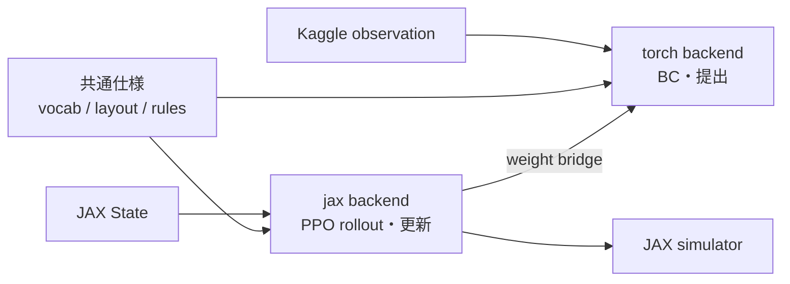
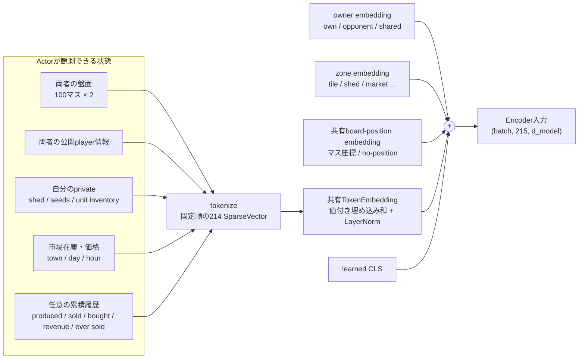
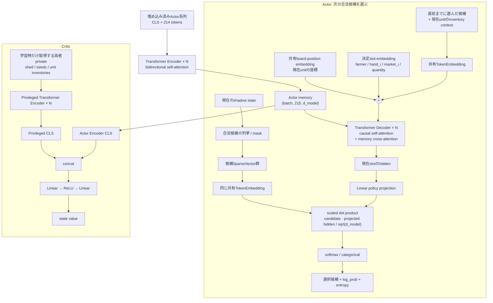
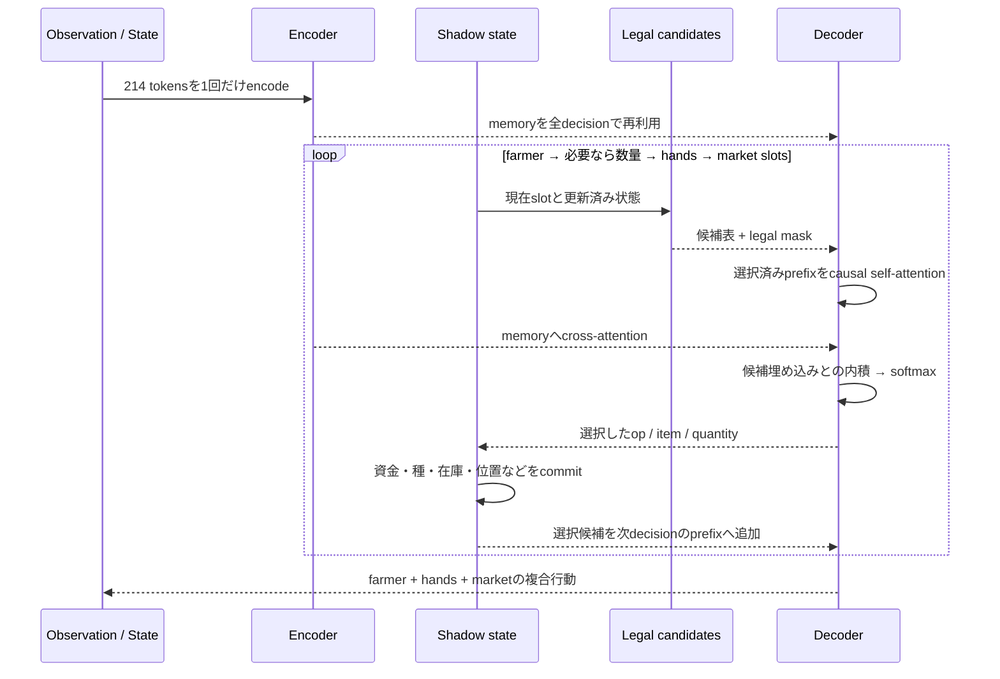

# kaggriculture.policy

盤面をTransformerで符号化し、farmer・hands・市場注文からなる1ターン分の複合行動を
自己回帰生成する方策です。静的ゲーム規則は`kaggriculture.rules`、方策内の共有仕様と
実行backendはこのパッケージ内で分離しています。

## 構成

| 場所 | 役割 |
|---|---|
| `common/` | backend間で共有する語彙、トークン配置、`ModelConfig`の型。Torch/JAXには依存しない |
| `torch/` | Python辞書観測の変換、旧BC経路、Kaggle提出用PyTorchモデル |
| `jax/` | 固定shapeの状態変換、合法手mask、Flaxモデル、BC/PPO用自己回帰処理 |

backend固有コードは必ず`kaggriculture.policy.torch`または
`kaggriculture.policy.jax`から明示的にimportします。親パッケージに互換re-exportは
置かず、誤ってCPU経路をJAX学習から呼ぶことを防ぎます。



JAXは学習時だけ必要です。PPO checkpointのactorを`training.export_policy`でPyTorchへ
変換すると、提出物にはJAX・Flax・criticを含めずに済みます。

## 入力と埋め込み

Actorへ渡すのは、自分が本番でも観測できる情報だけです。10×10の両者の盤面を
200トークンとし、プレイヤー情報、自分のshed・seeds・unit inventory、市場、街、時刻、
任意の累積履歴を加えた合計214トークンを作ります。相手のshed・seeds・unit inventoryは
Actor入力に含めません。

各トークンは単一IDではなく、複数の語彙indexと値を持つ`SparseVector`です。例えば作物、
タイル種別、収穫量、所有者などを同じトークンへ重ねます。内容埋め込みは概念的に
`LayerNorm(sum(value_i * embedding[index_i]))`です。品目の語彙は観測と行動候補で共有されるため、
盤面上のWHEATと「WHEATを植える・売る」という候補は同じ実体埋め込みを使います。



数量も連続値回帰ではありません。量1〜100に個別のcategorical語彙を持たせ、log正規化した
連続成分も補助的に加えます。これによりLayerNorm後にも数量を区別でき、PPOのlog probabilityへ
通常の選択と同様に含められます。

## Transformerと方策・価値出力

Encoderは全入力をself-attentionし、各トークンの文脈表現と局面を集約したCLSを返します。
Decoderは、これまでに選んだ候補を因果mask付きself-attentionで読み、Encoder memoryへ
cross-attentionして次の決定を表現します。

方策には行動空間全体へ固定logitを出す巨大な出力headがありません。その時点の合法候補を
作り、候補自身を共有`TokenEmbedding`で埋め込み、Decoder hiddenを線形射影したベクトルとの
内積で採点します。



`use_asymmetric_critic=False`ではActor EncoderのCLSだけをvalue headへ渡します。
`True`ではActorのmemoryを再計算せず、critic専用EncoderのCLSを連結します。価値損失は
共有埋め込みとActor Encoderにも流れますが、Actorの候補選択はprivileged系列を一切参照しません。
したがって本番推論で相手の非公開情報は不要で、提出用exportではcritic全体を除外できます。

## 複合行動の生成



生成順はfarmer → hand 0..N → 市場slot 0..9です。数量が必要な行動だけ直後に
数量候補1..上限を選びます。各決定をshadow stateへ反映するため、自分の先行行動で
消費した種・在庫・資金は後続候補へ即座に反映されます。市場WAITは数量0のSELLとして
環境へ渡し、状態を変えず注文indexだけを消費します。STOPは以後の注文を終了します。

この逐次性は依存関係を表現する代償として推論を遅くします。PyTorch提出経路は
柔軟なPython候補列挙を使います。JAX学習経路は候補表とmaskを固定shape化し、Encoderを
1回だけ実行、DecoderはKV cache付き88-step `lax.scan`で処理します。これにより方策生成、
両者の市場処理、シミュレータ、GAE、PPO更新までCPUへ戻さず実行できます。

## backend API

### PyTorch (`policy.torch.distribution`)

| API | 用途 |
|---|---|
| `predict_action(s)` | criticを実行しない提出・closed-loop推論 |
| `act` / `evaluate_actions` | PyTorch版PPO互換API |
| `evaluate_policy` | BCの教師強制評価 |
| `normalize_expert_action` | リプレイのno-op・上限超過を表現可能な教師へ正規化 |
| `validate_policy_action` | model実行なしで教師行動を合法候補と照合 |

旧PyTorch BCのbatch評価は既知の行動列を一括Decoder passへまとめます。互換用に
残していますが、新規学習はJAX BCを使います。固定shape cacheの詳細は`training/bc/README.md`を参照。

### JAX (`policy.jax.distribution`)

| API | 用途 |
|---|---|
| `sample_actions` | 1プレイヤーの複合行動を増分生成 |
| `sample_self_play_actions` | 両プレイヤーを1 network batchで生成 |
| `evaluate_choices` | 保存した候補index列をPPO更新時に再評価 |
| `state_values` | 両プレイヤーのbootstrap valueを計算 |

`training.ppo.rollout.collect_rollout`は生成と`step_batch_lockstep`を外側の`lax.scan`で
接続します。PPOは既定で各decisionの条件付きratioをclipする`ratio_mode=token`を使い、
長い複合行動の積でclipが飽和するのを抑えます。複合行動全体を1 actionとして扱う理論上の
`ratio_mode=joint`も比較用に残しています。`training.ppo.evaluation.evaluate_closed_loop`は
教師行動を使わず終端まで自走し、勝率と終端所持金を返します。

## 学習・提出

```bash
# BC (JAX)
uv run python -m kaggriculture.training.bc.train_jax

# PPO (JAX end-to-end)
uv run python -m kaggriculture.training.ppo.train \
  ppo.init_bc_checkpoint=/absolute/path/to/bc_jax/checkpoints/best

# 非対称criticを除外して提出用actorへ変換
uv run python -m kaggriculture.training.export_policy \
  /path/to/checkpoints/step_1000 /path/to/model_weights.pt
```

Hydra設定は`training/conf/`へ集約しています。`model/default.yaml`がBC/PPO共通の
モデル構造、`bc_jax.yaml`と`ppo.yaml`が学習方式固有の設定です。Python側の`ModelConfig`は
既定値を持たない型なので、学習時はHydra、提出時はcheckpointが必ず全項目を与えます。

```bash
# 合成・解決後の設定だけを確認
uv run python -m kaggriculture.training.ppo.train --cfg job

# 名前付きの単一実験。outputs/ppo/ablation_history/...へ保存
uv run python -m kaggriculture.training.ppo.train \
  experiment.name=ablation_history model.use_episode_history=true

# Hydra multirun。各runにはconfig.yamlとoverrides.yamlが残る
uv run python -m kaggriculture.training.ppo.train -m \
  experiment.name=model_size model.d_model=64,128 ppo.learning_rate=1e-4,3e-4
```

rollout sample数は`env.batch_size * ppo.rollout_horizon * 2`で、`ppo.minibatch_size`は
これを割り切る必要があります。`MAX_HANDS=32`はJAX配列の安全上限であり、リプレイ最大15
だけを根拠に24へ下げると、将来PPOが到達した合法状態をシミュレータだけで不正に
切り捨てるため維持します。

## 既知の近似

- 自己回帰中の市場shadow stateは自分の注文だけで更新します。実環境は同じindexの両者の
  SELL/BUY_PRODUCTをlockstep処理するため、相手注文次第で後続の価格・購入可能量がずれます。
- `estimated_bought_product`と`estimated_revenue`も同じ理由で推定値です。`produced`と`sold`は
  自分の確定行動から得られる値です。
- `use_episode_history=True`ではJAX rolloutが累積counterを状態として持ち回り、各turn開始時の
  値をPPO bufferへ保存します。推定値の制約は上記と同じです。
- 増分KV decodeと一括教師強制はfloat32演算順が異なり、複合行動log probabilityにおよそ
  `1e-3`以下の差が出ます。PPO clip幅より十分小さく、回帰テストで上限を監視します。
