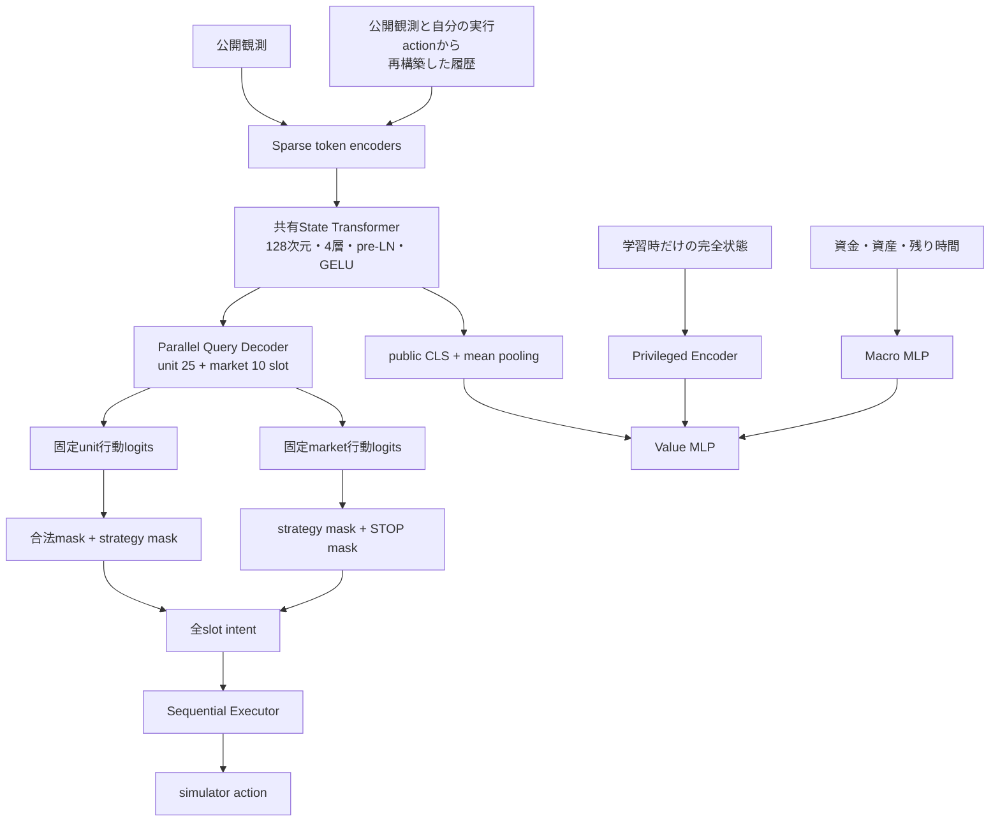

# kaggriculture.policy

V3方策は、公開状態を1回だけ符号化し、unitと市場注文の全35 slotを並列生成します。
JAX学習版とTorch提出版は同じ構造・mask・Executor規則を持ちます。

## 構造



State TransformerとQuery Decoderは1ターンに1回だけ実行します。unit 25 slotと市場10 slotは
self-attentionで互いの計画を参照しますが、選択結果によるcash・shedの変化は生成中には反映しません。
生成後、Executorがunitと市場intentを規定順に適用し、共有資源、数量上限、STOPを解決します。

## 入力

公開盤面、自分のprivate情報、市場、街、時刻、累積履歴を固定数のSparseVectorへ変換し、
`LayerNorm(sum(value_i * embedding[index_i]))`で埋め込みます。履歴は常に有効で、構造を切り替える
設定はありません。

criticだけが両プレイヤーのprivate状態とマクロ特徴を参照します。Actorと公開Encoderを共有し、提出時は
privileged Encoder・macro MLP・value headを使用しません。

## 行動とmask

unitと市場は固定行動語彙へ直接logitsを出します。合法性はネットワークに予測させず、決定論的なmaskで
適用します。strategy maskは合法maskと分離し、JAX/Torchで同じ規則を使います。

unitと市場を並列に選び、Executorが共有shed、atomic PLANT、市場注文を順番に解決します。
市場候補には状態から確実に判定できるstrategy maskを適用し、最初のSTOP以降のslotを無効化します。

数量は1〜100のcategoricalです。選択したop/itemで数量headを条件付けます。unitは確実な上限を採点前に
maskし、市場は先行slot依存のため全数量を採点してExecutorで実行可能量へ制約します。

## BC

リプレイのaction形式は変わりません。市場10 slotも一括評価します。
明示的なPASSは教師に使いますが、無効なFEED・WATER・BUILDなどが正規化されたPASSは、そのunit slot
だけpolicy lossから除外します。他slotとvalue教師は保持します。cacheには各局面の履歴counterも保存します。

## PPO

標準設定は、同じbehavior policyで完了試合を収集し、終端returnを全局面へ付与してから1回更新します。
市場注文列のold log probabilityは有効slotの対数確率の和です。更新時も保存した同じintentを
一括再評価します。

## 序盤コントローラの境界

序盤をルールで固定する場合は、`policy/opening/`をActorの上位に置きます。ルールがactionを返す局面では
それを使い、それ以外は既存Actorへ委譲します。Torch提出推論だけへ埋め込むとJAX rolloutと挙動がずれるため、
判定仕様を共通化し、JAX学習とTorch提出の両方から同じ境界で呼び出します。

序盤ルールを導入するまではディレクトリや抽象クラスを先に作らず、現在のActor APIを維持します。

## API

| API | 用途 |
|---|---|
| `jax.policy.sample_actions` | unitとmarketを一括生成 |
| `jax.policy.sample_self_play_actions` | 両プレイヤーを一括生成 |
| `jax.policy.evaluate_intent` | BC/PPOの保存済みintentを再評価 |
| `jax.policy.state_values` | 両席のvalueを計算 |
| `jax.executor.execute` | intentをsimulator actionへ変換 |
| `torch.policy.predict_action` | CPU提出推論 |

```bash
uv run python -m kaggriculture.training.bc.train
uv run python -m kaggriculture.training.ppo.train \
  ppo.init_bc_checkpoint=/path/to/bc/checkpoints/best
uv run python -m kaggriculture.training.export_policy \
  /path/to/checkpoint /path/to/model_weights.pt
```

モデル構造は`training/conf/model/default.yaml`の一種類だけです。V2 checkpointとは互換性がなく、
architecture versionで早期に拒否します。
