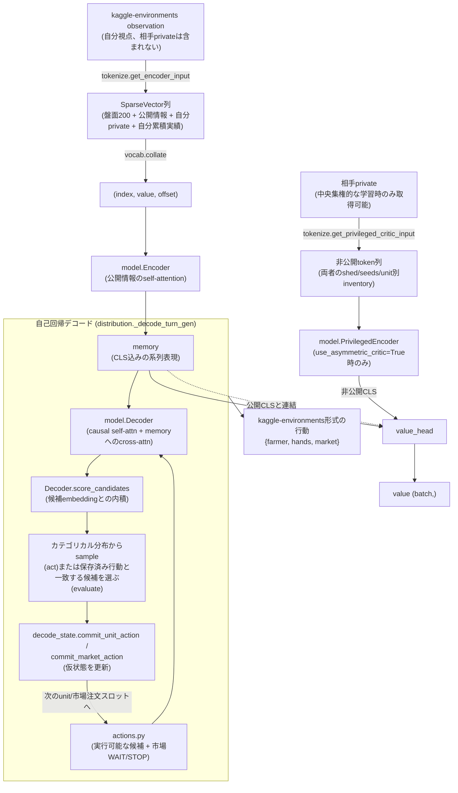
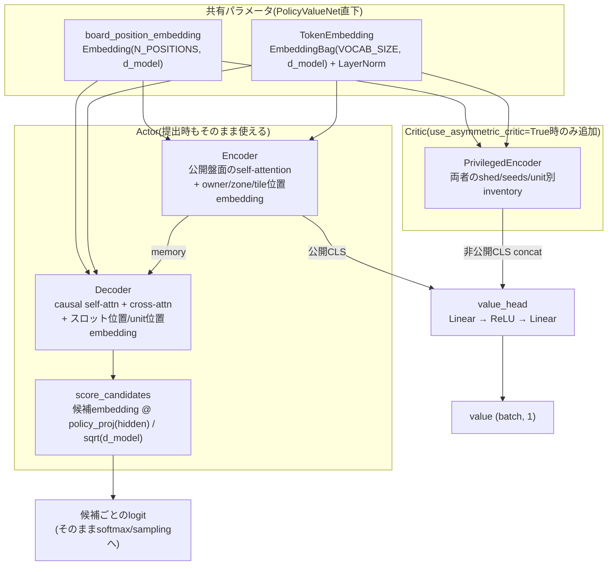
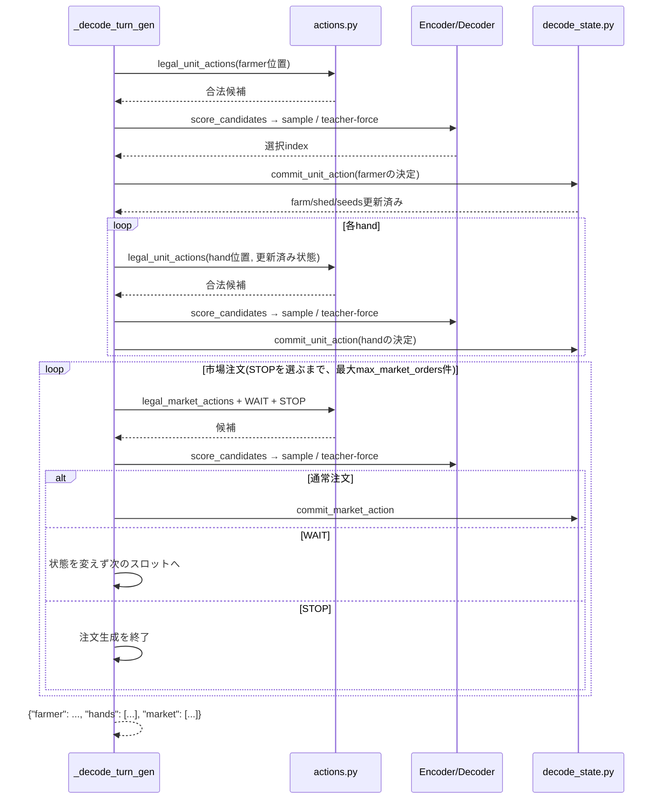

# kaggriculture.policy

Kaggle環境`kaggriculture`のobservation(dict)を受け取り、Transformerベースの
方策・価値ネットワークで1ターン分の行動(farmer→hands→市場注文)を生成・評価する
パッケージ。固定サイズの行動空間全体にスコアを付けるのではなく、その局面で
実行可能な候補と市場WAIT/STOPだけを都度列挙してスコアリングする(`actions.py`)。

## モジュール一覧

| モジュール | 役割 |
|---|---|
| `vocab.py` | EmbeddingBag用の疎特徴量(`SparseVector`)の語彙定義。品目・数量・累積実績などの添字を集中管理する |
| `tokenize.py` | 生observation → `SparseVector`列への変換(`get_encoder_input`/`get_privileged_critic_input`) |
| `token_layout.py` | トークン列の並び順・owner/zone/position契約。`tokenize.py`の出力順と必ず一致させる |
| `actions.py` | 実行可能な(op, item)候補と市場WAIT/STOPを列挙する(`legal_unit_actions`/`legal_market_actions`等) |
| `decode_state.py` | 自己回帰デコード中、確定した1決定をfarm/shed/seeds/marketの仮状態へ反映する |
| `model.py` | ネットワーク本体(`TokenEmbedding`/`Encoder`/`Decoder`/`PrivilegedEncoder`/`PolicyValueNet`) |
| `distribution.py` | `model.py`と学習・推論をつなぐ公開API(`act`/`evaluate_actions`/`predict_action`/`evaluate_policy`等) |
| `episode_history.py` | 確定した行動から累積実績(生産量・売上等)を算出し、`tokenize.py`のcounters入力を作る |

## データフロー

観測1つが固定長トークン列(`token_layout.NUM_WORDS_ENCODER`本、現在210)に変換され、
Encoder内で先頭にCLSを加えて公開情報を符号化する。行動は、決定スロットごとの候補を
Decoderでスコアリングして自己回帰的に生成される。

## モデル構造

`TokenEmbedding`(語彙埋め込み)と`board_position_embedding`(盤面位置埋め込み)は
Encoder・Decoder・PrivilegedEncoderの3つで**同一インスタンスを共有**する。
例えば「MELONを植える」候補と「MELONが植わっている」盤面トークンは、MELONを表す
`ENTITY_ITEM`成分を共有する。Decoderのunit位置とEncoderのタイル位置にも同じ位置埋め込みを
使い、cross-attentionが両者の座標関係を学びやすくする。

層数・`d_model`・head数・feed-forward幅・dropoutの現在値は`model_config.py`で管理する。

- **Actorだけで完結する経路**(`predict_action`/`evaluate_policy`)はCriticブランチに一切触れないため、`use_asymmetric_critic=True`で学習したチェックポイントでも提出時にそのまま使える。
- Criticブランチは公開盤面を再エンコードせず、Actor Encoderの出力(`memory`)をそのまま`value_head`へ再利用する(非公開情報だけを`PrivilegedEncoder`で別途符号化する)。

## 自己回帰デコードの順序

1ターンは farmer → hand₀ → hand₁ → … → 市場注文₀ → 市場注文₁ → … → STOP、の順で
1スロットずつ決定される。各unitの(op, item)決定の直後、数量を伴う場合のみ専用の
数量スロットが続く。確定するたびに`decode_state.py`が仮状態(shed在庫・種の残り・
市場価格等)を更新するため、自分の先行決定は後続の合法候補へ反映される。例えばfarmerが
納屋のWHEATを全部PICKUPした後は、hand₀にWHEAT PICKUPは候補として出ない。相手の同時市場
注文による変化は生成時点では未知なので、市場の仮状態には後述の近似がある。

`act()`(サンプリング)と`evaluate_actions()`/`evaluate_policy()`(教師強制)は、この
自己回帰ロジック(`_decode_turn_gen`)を共有する。違いは各スロットで次にどの候補を
選ぶかだけ(前者はネットワーク出力からsample、後者は保存済み行動から該当候補を
探す)。これにより、PPOの`ratio=exp(new_log_prob-old_log_prob)`に必要な「同じ順序・
同じ合法候補・同じ仮状態更新」が構造として保証される。

- **教師強制側の最適化**: `evaluate_actions_batch`/`evaluate_policy_batch`は行動が
  既知なので、まず候補選択をネットワーク無しで先に確定させ(`_decode_turn_teacher_force`)、
  環境ごとの全系列を1回だけDecoderに通す(自己注意がスロット数Tに対しO(T³)ではなくO(T²))。
- **候補スコアリングのバッチ化**: 同時にアクティブな環境・スロットをまとめてスコアリングする際、
  候補数の近いスロット同士でグループ化してpaddingする(`_score_candidates_grouped`)。
  数量スロット(最大100候補)とop系スロット(高々十数候補)を同じバッチでpaddingすると、
  大多数のop系スロットが無駄に100候補までpaddingされるため。
- **サンプリング側の制約**: `act_batch`は決定深度ごとに環境をまとめるが、自己回帰の各段階で
  Decoderのprefixを再計算する。候補列挙と仮状態更新もPython上で行うため、JAXシミュレータを
  含む完全なGPU end-to-end処理ではない。PPO更新時の教師強制よりrollout生成の方が重い。

## 公開API(`distribution.py`)

| 関数 | 用途 | Criticを実行するか | 勾配 | dropout |
|---|---|---|---|---|
| `act` / `act_batch` | PPOロールアウト収集。行動・価値・log_prob・entropyをまとめて返す | `use_asymmetric_critic=True`なら`opponent_private(s)`必須 | `torch.no_grad()` | 無効化 |
| `evaluate_actions` / `evaluate_actions_batch` | PPO更新時、保存済み行動を現在のパラメータで再評価する | 同上 | あり(backward可能) | 無効化 |
| `predict_action` / `predict_actions_batch` | 提出・評価用。Criticに一切触れず行動だけをサンプリングする | 実行しない(相手privateはAPIに存在しない) | `torch.no_grad()` | 無効化 |
| `evaluate_policy` / `evaluate_policy_batch` | BC学習用。expert行動をActorだけで教師強制評価し、log_prob/entropyを返す | 実行しない | あり(backward可能) | 呼び出し側の`net.train()`/`net.eval()`に従う |

- `act`系・`evaluate_actions`系はPPOの整合性のため常にdropoutを無効化するが、
  `evaluate_policy`系はBCで通常の教師あり学習(dropoutを正則化として使う)ができるよう、
  呼び出し側の学習/推論モードをそのまま尊重する。
- `use_episode_history=True`のネットは、全APIで`counters`(自分の累積実績。
  `episode_history.compute_turn_deltas`/`update_counters`で作る)が必須になる。
  省略すると「初期状態(全部ゼロ)」なのか「渡し忘れ」なのか区別できないため、
  `counters=None`は明示的に`ValueError`になる(`use_asymmetric_critic`の
  `opponent_private(s)`も同様)。

## BC用リプレイの入力契約

`evaluate_policy`系は、expert行動を各スロットの候補から教師強制できることを前提とする。
Kaggleの生リプレイには在庫0へのSELL、数量0、上限を大きく超える数量など、実行時にno-opまたは
クランプされる注文も含まれる。効果のないunit行動は`PASS`へ正規化する。

市場注文はindexを保つ必要がある。正規形のWAITである`["SELL", "WHEAT", 0]`はそのまま教師強制
できるが、それ以外の無効注文は前処理でWAITへ正規化する。無効注文を削除すると後続注文が前へずれ、
両プレイヤーを同じindexで処理する市場キューの結果が変わり得る。数量が実行可能上限を超える通常注文も、
シミュレータ上の成立量へ正規化するか、そのサンプルを除外する。

## 既知の限界

- 市場WAITは方策内部だけの候補で、Kaggle actionでは`["SELL", "WHEAT", 0]`へ変換する。
  固定している`kaggle-environments`では状態を変えず1スロットを消費する。環境バージョンを更新する際は、
  数量0の解析仕様とJAXシミュレータとの一致を再検証する。
- 自己回帰中の`decode_state`は、自分の市場注文だけで仮状態を更新する。実環境では両プレイヤーの
  同じindexのSELL/BUY_PRODUCTをlockstepで処理するため、相手注文によって市場在庫・価格・購入可能量が
  変わり、後続市場注文の候補計算と実際の決済結果がずれることがある。
- `episode_history`の`estimated_bought_product`/`estimated_revenue`は、
  `market_lockstep`(SELL/BUY_PRODUCTの同時処理)を自分の注文だけで単独再生した
  見積もりであり、相手が同ターンに同じ品目を売買していると実際の値とずれうる。
  `produced`/`sold`は自分の行動だけから確定できる正確な値。reward shapingで
  確定実績が必要な場合は`estimated_`接頭辞の項目を避けること。
- `use_asymmetric_critic=True`で学習したモデルの`value()`は、相手の非公開状態
  (`opponent_private`)が無いと評価できない。提出環境では原理的に用意できないため、
  提出時は必ず`predict_action`/`predict_actions_batch`を使うこと(`act`/`act_batch`を
  `opponent_private`無しで呼ぶとエラーになる)。
